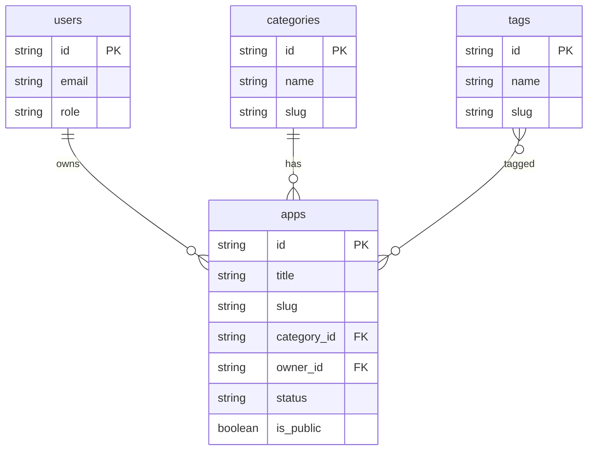

# SimHope 工具箱 — 產品規格文件（PRD）

> **文件版本**：v1.0  
> **建立日期**：2026-02-25  
> **撰寫者**：Product Architect  
> **專案代號**：SimHope Toolbox

---

## 1. 產品定位與目標用戶

### 1.1 產品定位

SimHope 工具箱是一個**個人作品展示與應用管理平台（Portfolio + App Showcase Platform）**，專為 AI 應用創作者設計。平台集中收錄來自 Google AI Studio、Gemini Canvas 與各類 Web App 的應用作品，提供統一的展示介面、分類管理與後台維護功能。

產品的核心定位介於「開發者作品集」與「輕量級應用市集」之間——初期作為個人創作者的作品管理中心，架構上預留擴展為公開分享平台或模板市集的能力。

### 1.2 目標使用者輪廓（Persona）

| 角色 | 描述 | 核心需求 |
|------|------|----------|
| **創作者（Owner）** | 單人 AI 應用開發者，使用 Google AI Studio、Gemini Canvas 等工具產出應用 | 統一管理所有作品、快速上架展示、分類整理、控制公開/私有 |
| **訪客（Visitor）** | 來自社群、LinkedIn、技術社群的潛在合作者或雇主 | 瀏覽作品集、了解應用功能與技術細節、取得應用連結 |
| **未來：社群用戶** | 其他 AI 創作者，瀏覽或分享自己的應用 | 發現新應用、參考模板、互動交流 |

### 1.3 使用情境（Use Cases）

1. **作品上架**：創作者完成一個 Gemini Canvas 應用後，登入後台，填寫應用名稱、描述、截圖、分類標籤、外部連結，一鍵發布至前台展示。
2. **作品瀏覽**：訪客進入首頁，透過分類篩選或搜尋關鍵字，找到感興趣的應用，點入查看詳情、截圖與使用說明。
3. **作品管理**：創作者在後台調整某個應用的狀態為「私有」，該應用不再出現在前台。也可批次修改標籤或分類。
4. **外部分享**：創作者複製某應用的詳情頁連結，貼到 LinkedIn 或履歷中作為作品展示。

### 1.4 產品價值主張（Value Proposition）

- **集中管理，告別散落**：不再需要分散在 Google Drive、Notion、個人網站之間維護作品。
- **專業展示，一鍵分享**：每個應用都有獨立的精美介紹頁，可直接分享給任何人。
- **結構化分類**：透過來源平台、應用類型、標籤三維度分類，作品越多越有條理。
- **未來可擴展**：架構預留多用戶、社群分享、評分評論等機制，可從個人工具成長為公開平台。

---

## 2. 資訊架構（Information Architecture）

### 2.1 全站 Sitemap

```
SimHope 工具箱
├── 🏠 首頁（Landing Page）                          [公開]
├── 📱 應用列表頁（App Gallery）                      [公開]
│   ├── 依分類篩選（Category Filter）
│   ├── 依標籤篩選（Tag Filter）
│   ├── 依來源篩選（Source Filter）
│   └── 搜尋結果頁
├── 📄 應用詳情頁（App Detail Page）                  [公開/權限控制]
│   ├── 應用說明
│   ├── 截圖輪播
│   ├── 功能特色
│   ├── 使用方式
│   └── 外部連結
├── 🔐 登入頁（Login Page）                           [公開]
├── ⚙️ 後台管理（Admin Dashboard）                    [需登入]
│   ├── 應用管理
│   │   ├── 新增應用
│   │   ├── 編輯應用
│   │   └── 刪除應用
│   ├── 分類管理
│   ├── 標籤管理
│   └── 個人設定
├── 📖 關於頁面（About Page）                         [公開]
└── 🔗 頁尾（Footer）
    ├── 社群連結
    └── 版權資訊
```

### 2.2 導覽邏輯說明

**頂部導覽列（Navbar）** 固定於頁面頂端，包含以下項目：

| 導覽項 | 連結目標 | 登入前 | 登入後 |
|--------|----------|--------|--------|
| Logo / 品牌名 | 首頁 | ✅ | ✅ |
| 應用展示 | App Gallery | ✅ | ✅ |
| 關於 | About Page | ✅ | ✅ |
| 登入 | Login Page | ✅ | ❌ |
| 後台管理 | Admin Dashboard | ❌ | ✅ |
| 登出 | — | ❌ | ✅ |

導覽列在行動裝置上收合為 hamburger menu。App Gallery 頁面左側（或頂部）額外提供分類與標籤的篩選面板。

### 2.3 公開頁面 vs 登入後頁面

| 存取層級 | 頁面 | 說明 |
|----------|------|------|
| 公開 | 首頁、App Gallery、App Detail（公開作品）、關於、登入頁 | 任何人皆可存取 |
| 需登入（Admin） | Admin Dashboard 全部功能 | 僅限 Owner 角色 |
| 權限控制 | App Detail（私有作品） | 設為 `is_public = false` 的作品僅 Owner 可見 |

---

## 3. 核心功能模組拆解（Feature Breakdown）

### 3.1 首頁（Landing Page）

**功能目的**：第一印象入口，傳達平台定位，展示精選作品，引導訪客進入 App Gallery。

**必備元素**：
- Hero Section：品牌標語 + 簡述 + CTA 按鈕（「探索應用」→ App Gallery）
- 精選作品區：展示 3~6 個標記為 `is_featured` 的應用卡片
- 數據統計區：應用總數、分類數、來源平台數（動態計算）
- 來源平台區：以 icon 展示支援的平台（Google AI Studio、Gemini Canvas、Web App）

**未來擴充**：最新上架區塊、最多人瀏覽排行、社群動態 feed。

---

### 3.2 應用列表頁（App Gallery）

**功能目的**：以卡片式 Grid 佈局展示所有公開應用，支援多維度篩選與搜尋。

**必備欄位（卡片顯示）**：
- 應用封面圖（thumbnail）
- 應用名稱
- 簡短描述（最多 100 字截斷）
- 來源平台 badge
- 分類標籤（最多顯示 3 個）
- 發布日期

**使用流程**：
1. 訪客進入 App Gallery，預設顯示全部公開應用，按發布日期降序排列。
2. 可透過左側面板選擇分類（Category）、自由選擇標籤（Tag）、選擇來源平台（Source）做交叉篩選。
3. 可透過頂部搜尋列輸入關鍵字，模糊比對應用名稱與描述。
4. 點擊卡片進入 App Detail Page。

**未來擴充**：無限捲動 / 分頁、排序切換（最新 / 最熱門）、卡片 / 列表視圖切換、收藏功能。

---

### 3.3 應用詳情頁（App Detail Page）

**功能目的**：展示單一應用的完整資訊，作為可獨立分享的永久連結頁面。

**必備欄位**：
- 應用名稱（title）
- 完整描述（description，支援 Markdown 渲染）
- 截圖輪播（screenshots，1~10 張）
- 功能特色列表（features，條列式）
- 使用方式說明（usage_guide）
- 來源平台（source_platform）
- 分類（category）
- 標籤（tags）
- 外部連結（external_url）— 連到實際應用
- 發布日期
- 最後更新日期

**頁面結構**：
```
┌──────────────────────────────────────┐
│ Breadcrumb: 首頁 > 應用展示 > [應用名] │
├──────────────────────────────────────┤
│ [封面圖/截圖輪播]                      │
├──────────────────────────────────────┤
│ 應用名稱          [開啟應用] 按鈕       │
│ 來源 badge | 分類 | 標籤              │
│ 發布日期 | 最後更新                    │
├──────────────────────────────────────┤
│ ## 應用說明                           │
│ (Markdown 渲染)                       │
├──────────────────────────────────────┤
│ ## 功能特色                           │
│ ✅ 功能 1                             │
│ ✅ 功能 2                             │
├──────────────────────────────────────┤
│ ## 使用方式                           │
│ (步驟說明)                            │
└──────────────────────────────────────┘
```

**未來擴充**：評分與評論系統、相關應用推薦、分享按鈕（社群）、嵌入式 demo iframe。

---

### 3.4 分類與標籤系統（Category / Tag System）

**功能目的**：提供兩層分類維度——分類（Category）為樹狀單選結構，標籤（Tag）為扁平多選結構。

**分類（Category）設計**：
- 採單層結構（MVP 不做巢狀），一個應用只屬於一個分類。
- 預設分類範例：`生產力工具`、`AI 助手`、`資料分析`、`創意工具`、`教育學習`、`實驗性專案`。

**標籤（Tag）設計**：
- 自由建立，一個應用可掛多個標籤。
- 範例：`Gemini API`、`RAG`、`圖片生成`、`文字處理`、`翻譯`、`多模態`。

**來源平台（Source Platform）**：
- 作為獨立篩選維度，固定選項：`Google AI Studio`、`Gemini Canvas`、`Web App`、`其他`。

**後台管理**：可在 Admin Dashboard 中新增、編輯、刪除分類與標籤。刪除前檢查是否有關聯的應用。

**未來擴充**：巢狀分類、標籤權重、熱門標籤雲。

---

### 3.5 搜尋功能

**功能目的**：讓訪客快速透過關鍵字找到目標應用。

**MVP 實作方式**：
- 前端全文搜尋（使用 Fuse.js 或等效方案），比對欄位為 `title`、`description`、`tags`。
- 搜尋框位於 App Gallery 頁面頂部。
- 即時搜尋（debounce 300ms），無需按 Enter。
- 搜尋結果直接替換 Gallery 卡片區域。

**未來擴充**：後端全文搜尋（Algolia / Meilisearch）、搜尋建議、搜尋歷史。

---

### 3.6 後台管理系統（Admin Dashboard）

**功能目的**：提供創作者完整的 CRUD 介面來管理所有作品與分類資料。

**模組拆分**：

#### 3.6.1 應用管理
- **新增應用**：表單填寫所有欄位，截圖支援拖拽上傳（存至 Cloud Storage），支援儲存為草稿（`status: draft`）或直接發布（`status: published`）。
- **編輯應用**：與新增相同表單，預填現有資料。
- **刪除應用**：軟刪除（`status: archived`），可還原。
- **列表檢視**：表格形式，顯示名稱、狀態、分類、發布日期，支援排序與篩選。
- **快速操作**：切換公開/私有、切換精選、變更狀態。

#### 3.6.2 分類管理
- CRUD 介面，顯示每個分類關聯的應用數量。
- 刪除時若有關聯應用需先解除關聯或搬移。

#### 3.6.3 標籤管理
- CRUD 介面，可合併重複標籤。
- 顯示每個標籤被使用的次數。

#### 3.6.4 個人設定
- 修改品牌名稱、Logo、社群連結、關於頁面內容。

**未來擴充**：批次操作、匯入/匯出（CSV/JSON）、操作日誌、數據分析面板（瀏覽量、點擊率）。

---

### 3.7 使用者帳號系統

**功能目的**：MVP 階段僅需單一 Owner 帳號用於後台管理，不開放註冊。

**MVP 實作**：
- 使用 Firebase Authentication（Google 登入）。
- 環境變數設定 `ADMIN_EMAIL`，登入後比對 email，符合者授予 Admin 角色。
- 不匹配的 email 拒絕存取後台。

**未來擴充**：多用戶註冊、角色權限（Admin / Editor / Viewer）、OAuth 多平台登入。

---

## 4. 資料結構設計（Database Schema）

> 以 Firestore Collection 形式表示，但結構相容於 SQL。欄位型別以 TypeScript 型別標記。

### 4.1 apps（應用資料表）

| 欄位名稱 | 型別 | 說明 | 備註 |
|----------|------|------|------|
| `id` | `string` | 文件 ID | **PK**，自動生成 |
| `title` | `string` | 應用名稱 | 必填，最大 100 字 |
| `slug` | `string` | URL slug | 唯一，用於 SEO 友善 URL |
| `description` | `string` | 完整描述 | 支援 Markdown，最大 5000 字 |
| `short_description` | `string` | 簡短描述 | 卡片用，最大 150 字 |
| `thumbnail_url` | `string` | 封面圖 URL | 必填 |
| `screenshots` | `string[]` | 截圖 URL 陣列 | 1~10 張 |
| `features` | `string[]` | 功能特色列表 | 條列式 |
| `usage_guide` | `string` | 使用方式說明 | 支援 Markdown |
| `external_url` | `string` | 應用外部連結 | 必填 |
| `source_platform` | `enum` | 來源平台 | `ai_studio` / `gemini_canvas` / `web_app` / `other` |
| `category_id` | `string` | 分類 ID | **FK → categories.id** |
| `tag_ids` | `string[]` | 標籤 ID 陣列 | **FK → tags.id** |
| `status` | `enum` | 狀態 | `draft` / `published` / `archived` |
| `is_public` | `boolean` | 是否公開 | 預設 `true` |
| `is_featured` | `boolean` | 是否精選 | 預設 `false` |
| `sort_order` | `number` | 排序權重 | 預設 `0`，越大越前 |
| `owner_id` | `string` | 擁有者 ID | **FK → users.id** |
| `created_at` | `timestamp` | 建立時間 | 自動 |
| `updated_at` | `timestamp` | 更新時間 | 自動 |

### 4.2 categories（分類資料表）

| 欄位名稱 | 型別 | 說明 | 備註 |
|----------|------|------|------|
| `id` | `string` | 文件 ID | **PK** |
| `name` | `string` | 分類名稱 | 唯一，必填 |
| `slug` | `string` | URL slug | 唯一 |
| `description` | `string` | 分類描述 | 選填 |
| `icon` | `string` | 圖示名稱或 URL | 選填 |
| `sort_order` | `number` | 排序權重 | 預設 `0` |
| `created_at` | `timestamp` | 建立時間 | 自動 |

### 4.3 tags（標籤資料表）

| 欄位名稱 | 型別 | 說明 | 備註 |
|----------|------|------|------|
| `id` | `string` | 文件 ID | **PK** |
| `name` | `string` | 標籤名稱 | 唯一，必填 |
| `slug` | `string` | URL slug | 唯一 |
| `color` | `string` | 標籤顏色 | HEX 色碼，選填 |
| `created_at` | `timestamp` | 建立時間 | 自動 |

### 4.4 users（使用者資料表）

| 欄位名稱 | 型別 | 說明 | 備註 |
|----------|------|------|------|
| `id` | `string` | Firebase UID | **PK** |
| `email` | `string` | Email | 唯一 |
| `display_name` | `string` | 顯示名稱 | |
| `avatar_url` | `string` | 頭像 URL | |
| `role` | `enum` | 角色 | `admin` / `viewer` |
| `created_at` | `timestamp` | 建立時間 | 自動 |
| `last_login_at` | `timestamp` | 最後登入時間 | 自動 |

### 4.5 site_settings（網站設定 — 單一文件）

| 欄位名稱 | 型別 | 說明 |
|----------|------|------|
| `site_name` | `string` | 網站名稱 |
| `site_description` | `string` | 網站描述 |
| `logo_url` | `string` | Logo URL |
| `about_content` | `string` | 關於頁面內容（Markdown） |
| `social_links` | `object` | 社群連結 `{ github, linkedin, twitter, email }` |
| `hero_title` | `string` | 首頁 Hero 標題 |
| `hero_subtitle` | `string` | 首頁 Hero 副標題 |

### 4.6 ER 關係圖


