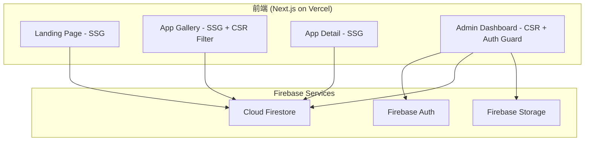

---

## 5. 技術架構建議（Tech Stack Proposal）

### 5.1 推薦技術棧

| 層級 | MVP 推薦 | 理由 |
|------|----------|------|
| **前端框架** | **Next.js 14+（App Router）** | SSG/SSR 混合渲染，SEO 優異，React 生態成熟，Vercel 原生支援 |
| **UI 框架** | **Tailwind CSS + shadcn/ui** | 高度可客製、元件品質高、不綁定設計語言、bundle 小 |
| **後端/BaaS** | **Firebase（Firestore + Auth + Storage）** | 你已有 Firebase 使用經驗（從對話歷史得知），免運維、免費額度充足、即時同步 |
| **資料庫** | **Cloud Firestore** | NoSQL 文件型，適合此應用的資料結構，查詢能力足夠 MVP |
| **檔案儲存** | **Firebase Storage** | 截圖、封面圖上傳，與 Firebase 整合零配置 |
| **部署** | **Vercel** | Next.js 原生部署平台，CI/CD 自動化，免費方案足夠個人使用 |
| **搜尋** | **Fuse.js（客戶端）** | MVP 無需額外服務，應用數量 <100 時效能充足 |
| **Markdown 渲染** | **react-markdown + remark-gfm** | 渲染應用描述與使用說明 |

### 5.2 架構圖



### 5.3 Trade-off 分析

**為何選 Next.js 而非 Vite + React SPA？**
- 此平台的公開頁面（首頁、Gallery、Detail）需要 SEO，Next.js 的 SSG 可在 build time 預渲染所有公開頁面，Google 爬蟲直接取得完整 HTML。純 SPA 需額外設置 SSR 或 prerender。
- App Router 的 Server Components 可減少客戶端 JS bundle。
- 後台管理頁面使用 CSR，不影響 SEO 需求。

**為何選 Firebase 而非 Supabase？**
- 你已有 Firebase 實戰經驗，降低學習成本。
- Firestore 的即時監聽對後台管理體驗好（修改即反映）。
- Supabase（PostgreSQL）在結構化查詢上更強，但此專案不需要複雜 JOIN，Firestore 足矣。
- 若未來擴展為多用戶平台且需複雜查詢，可遷移至 Supabase。

**為何不用 Headless CMS（Strapi / Contentful）？**
- 增加額外依賴與運維成本（Strapi 需自架伺服器，Contentful 有 entry 限制）。
- Firebase 已涵蓋 CMS 所需的資料存取與檔案管理功能。
- 若未來需要更豐富的內容管理（部落格、Rich Text Editor），再考慮引入 Sanity 等 Headless CMS。

**Low-code 是否適合？**
- 不建議。此專案需要高度客製化的 UI 與互動體驗，low-code 平台（如 Bubble、Webflow）在細節調控上有限制，且鎖定生態。

### 5.4 MVP vs 進階版本差異

| 面向 | MVP v1.0 | 進階版 v2.0+ |
|------|----------|-------------|
| 渲染策略 | SSG（build time 靜態生成） | ISR（Incremental Static Regeneration）按需更新 |
| 搜尋 | Fuse.js 客戶端搜尋 | Algolia / Meilisearch 全文搜尋 |
| 用戶系統 | 單一 Admin | 多用戶註冊 + 角色權限 |
| 圖片處理 | 直接上傳原圖 | 自動壓縮 + WebP 轉換 + CDN |
| 分析 | 無 | 瀏覽量追蹤、GA4 整合 |
| 社群功能 | 無 | 評論、評分、收藏、分享 |
| 國際化 | 繁體中文 | i18n 多語言 |

---

## 6. UI/UX 設計指引

### 6.1 整體視覺風格

以 **「AI 工具 SaaS + 開發者 Portfolio」** 為風格交集，參考設計方向：

- **主基調**：深色主題（Dark Mode First），傳達科技感與 AI 氛圍。
- **視覺語言**：乾淨、資訊密度適中、重視留白與層次。
- **參考風格**：Vercel Dashboard、Linear App、Raycast Website。
- **動態感**：卡片 hover 微動畫、頁面切換 transition、漸層光暈效果（Glow Effect）。

### 6.2 色彩系統

| 用途 | 色碼 | 說明 |
|------|------|------|
| 背景（主） | `#0A0A0B` | 深黑，近乎純黑 |
| 背景（卡片） | `#141416` | 微亮黑，區隔層次 |
| 背景（懸浮/Active） | `#1C1C1F` | 互動回饋 |
| 主色（Primary） | `#6366F1` → `#818CF8` | Indigo 漸層，CTA 按鈕、連結 |
| 強調色（Accent） | `#22D3EE` | Cyan，badge、高亮 |
| 文字（主） | `#F5F5F5` | 高對比白 |
| 文字（次） | `#A1A1AA` | 灰色副文字 |
| 邊框 | `#27272A` | 微妙分隔線 |
| 成功 | `#22C55E` | 狀態標示 |
| 警告 | `#F59E0B` | 狀態標示 |
| 錯誤 | `#EF4444` | 狀態標示 |

### 6.3 卡片設計原則

應用卡片是平台最高頻出現的 UI 元素，設計需特別講究：

```
┌─────────────────────────┐
│  ┌─────────────────────┐ │
│  │                     │ │  ← 封面圖（16:9 比例，object-cover）
│  │    Thumbnail        │ │
│  │                     │ │
│  └─────────────────────┘ │
│                           │
│  [AI Studio] badge        │  ← 來源平台小標籤（左上角 or 圖片上）
│                           │
│  應用名稱                  │  ← font-semibold, text-lg
│  簡短描述文字最多兩行...   │  ← text-sm, text-zinc-400, line-clamp-2
│                           │
│  ┌────┐ ┌────┐ ┌────┐    │  ← 標籤 chips（最多 3 個）
│  │ RAG│ │翻譯│ │多模態│  │
│  └────┘ └────┘ └────┘    │
│                           │
│  2026-02-20              │  ← text-xs, text-zinc-500
└─────────────────────────┘
```

**互動規範**：
- Hover：卡片整體 `scale(1.02)` + `border-color` 變亮 + 陰影加深，transition 200ms。
- 點擊：整張卡片可點擊，導向 App Detail Page。
- 封面圖加載：使用 `next/image` 搭配 blur placeholder。

### 6.4 Typography

| 用途 | 字型 | 大小 | 備註 |
|------|------|------|------|
| 品牌/標題 | Inter / Noto Sans TC | 2xl~4xl | 中英混排 |
| 內文 | Inter / Noto Sans TC | base | line-height 1.6 |
| 程式碼 | JetBrains Mono | sm | Markdown 內 code block |
| 數字/badge | Inter | xs~sm | tracking-wide |

### 6.5 設計系統選擇

**推薦 shadcn/ui**，理由：
- 非 npm 套件，而是複製原始碼到專案中，完全可客製。
- 基於 Radix UI primitives，a11y 完善。
- 預設支援 Dark Mode。
- 與 Tailwind CSS 深度整合。
- 社群活躍，元件齊全（Dialog, Dropdown, Table, Form, Toast…）。

不推薦 Material UI：過於「Google 風格」，與 AI/SaaS 定位不符，且 bundle 較大。

### 6.6 響應式斷點

| 斷點 | 寬度 | Gallery 欄數 | 說明 |
|------|------|-------------|------|
| Mobile | < 640px | 1 欄 | 單列卡片 |
| Tablet | 640~1024px | 2 欄 | 雙列 |
| Desktop | 1024~1440px | 3 欄 | 標準桌面 |
| Wide | > 1440px | 4 欄 | 大螢幕 |

---

## 7. AI Agent 執行指令版本

以下為可直接交付給建站 AI Agent 的結構化任務說明：

```yaml
project:
  name: "simhope-toolbox"
  display_name: "SimHope 工具箱"
  description: "AI 應用作品展示與管理平台"
  language: "zh-TW"

tech_stack:
  framework: "Next.js 14+ (App Router)"
  ui: "Tailwind CSS 4 + shadcn/ui"
  backend: "Firebase (Firestore + Auth + Storage)"
  deployment: "Vercel"
  search: "Fuse.js"
  markdown: "react-markdown + remark-gfm"
  package_manager: "pnpm"

pages:
  - route: "/"
    name: "Landing Page"
    type: "SSG"
    components:
      - Hero section with site name, tagline, CTA button to /apps
      - Featured apps grid (3-6 cards, filter by is_featured=true)
      - Stats section (total apps, categories, platforms)
      - Platform showcase (Google AI Studio, Gemini Canvas, Web App icons)

  - route: "/apps"
    name: "App Gallery"
    type: "SSG + CSR filtering"
    components:
      - Search bar (Fuse.js, debounce 300ms, fields: title, description, tags)
      - Filter sidebar/top-bar (Category, Tag, Source Platform)
      - App card grid (responsive: 1/2/3/4 cols)
      - Empty state when no results

  - route: "/apps/[slug]"
    name: "App Detail Page"
    type: "SSG (generateStaticParams)"
    components:
      - Breadcrumb navigation
      - Screenshot carousel (Swiper or Embla)
      - App title, badges (source, category, tags)
      - Markdown-rendered description
      - Feature list (checkmark items)
      - Usage guide section
      - External link CTA button
      - Dates (published, updated)

  - route: "/about"
    name: "About Page"
    type: "SSG"
    components:
      - About content (Markdown from site_settings)
      - Social links

  - route: "/login"
    name: "Login Page"
    type: "CSR"
    components:
      - Google sign-in button (Firebase Auth)
      - Redirect to /admin on success (if admin), else show error

  - route: "/admin"
    name: "Admin Dashboard"
    type: "CSR, auth-guarded"
    sub_routes:
      - route: "/admin"
        name: "Dashboard Overview"
        components: [Stats cards, recent apps list]
      - route: "/admin/apps"
        name: "App Management"
        components: [Data table with sort/filter, status badges, quick actions]
      - route: "/admin/apps/new"
        name: "Create App"
        components: [Full form with all fields, image upload, tag multi-select, category select, Markdown editor, preview]
      - route: "/admin/apps/[id]/edit"
        name: "Edit App"
        components: [Same as create, pre-filled]
      - route: "/admin/categories"
        name: "Category Management"
        components: [CRUD table, app count display]
      - route: "/admin/tags"
        name: "Tag Management"
        components: [CRUD table, usage count, color picker]
      - route: "/admin/settings"
        name: "Site Settings"
        components: [Site name, logo upload, social links, about content editor]

data_schema:
  collections:
    apps:
      fields:
        id: { type: string, auto: true, pk: true }
        title: { type: string, required: true, max: 100 }
        slug: { type: string, unique: true }
        description: { type: string, max: 5000, markdown: true }
        short_description: { type: string, max: 150 }
        thumbnail_url: { type: string, required: true }
        screenshots: { type: "string[]", min: 1, max: 10 }
        features: { type: "string[]" }
        usage_guide: { type: string, markdown: true }
        external_url: { type: string, required: true }
        source_platform: { type: enum, values: [ai_studio, gemini_canvas, web_app, other] }
        category_id: { type: string, fk: categories.id }
        tag_ids: { type: "string[]", fk: tags.id }
        status: { type: enum, values: [draft, published, archived], default: draft }
        is_public: { type: boolean, default: true }
        is_featured: { type: boolean, default: false }
        sort_order: { type: number, default: 0 }
        owner_id: { type: string, fk: users.id }
        created_at: { type: timestamp, auto: true }
        updated_at: { type: timestamp, auto: true }

    categories:
      fields:
        id: { type: string, pk: true }
        name: { type: string, unique: true }
        slug: { type: string, unique: true }
        description: { type: string }
        icon: { type: string }
        sort_order: { type: number, default: 0 }
        created_at: { type: timestamp, auto: true }

    tags:
      fields:
        id: { type: string, pk: true }
        name: { type: string, unique: true }
        slug: { type: string, unique: true }
        color: { type: string }
        created_at: { type: timestamp, auto: true }

    users:
      fields:
        id: { type: string, pk: true }
        email: { type: string, unique: true }
        display_name: { type: string }
        avatar_url: { type: string }
        role: { type: enum, values: [admin, viewer] }
        created_at: { type: timestamp, auto: true }
        last_login_at: { type: timestamp, auto: true }

    site_settings:
      single_document: true
      fields:
        site_name: { type: string }
        site_description: { type: string }
        logo_url: { type: string }
        about_content: { type: string, markdown: true }
        social_links: { type: object, shape: { github: string, linkedin: string, twitter: string, email: string } }
        hero_title: { type: string }
        hero_subtitle: { type: string }

design:
  theme: "dark-first"
  colors:
    bg_primary: "#0A0A0B"
    bg_card: "#141416"
    bg_hover: "#1C1C1F"
    primary: "indigo-500 to indigo-400 gradient"
    accent: "#22D3EE"
    text_primary: "#F5F5F5"
    text_secondary: "#A1A1AA"
    border: "#27272A"
  fonts:
    heading: "Inter + Noto Sans TC"
    body: "Inter + Noto Sans TC"
    mono: "JetBrains Mono"
  card_hover: "scale(1.02) + border highlight + shadow, 200ms transition"
  responsive_grid: [1, 2, 3, 4]  # cols at sm/md/lg/xl

mvp_priority:
  phase_1_core:
    - "Project scaffold (Next.js + Tailwind + shadcn/ui + Firebase)"
    - "Firebase config (Auth + Firestore + Storage)"
    - "Data layer (Firestore service functions for all collections)"
    - "Auth flow (Google login, admin guard middleware)"
    - "Admin: App CRUD (create, edit, delete, list)"
    - "Admin: Category & Tag CRUD"
    - "Public: App Gallery (card grid + filters)"
    - "Public: App Detail Page"
    - "Public: Landing Page"

  phase_2_polish:
    - "Image upload with preview (Firebase Storage)"
    - "Markdown editor with live preview"
    - "Search (Fuse.js)"
    - "SEO (meta tags, OG images, sitemap.xml)"
    - "About page + Site settings admin"
    - "Responsive design final pass"
    - "Loading states & error boundaries"

  phase_3_enhancement:
    - "ISR for dynamic content"
    - "Analytics (GA4)"
    - "Image optimization (auto WebP, compression)"
    - "PWA support"
    - "i18n preparation"

firestore_security_rules: |
  rules_version = '2';
  service cloud.firestore {
    match /databases/{database}/documents {
      // Public read for published & public apps
      match /apps/{appId} {
        allow read: if resource.data.status == 'published' && resource.data.is_public == true;
        allow read, write: if request.auth != null && get(/databases/$(database)/documents/users/$(request.auth.uid)).data.role == 'admin';
      }
      // Public read for categories and tags
      match /categories/{docId} {
        allow read: if true;
        allow write: if request.auth != null && get(/databases/$(database)/documents/users/$(request.auth.uid)).data.role == 'admin';
      }
      match /tags/{docId} {
        allow read: if true;
        allow write: if request.auth != null && get(/databases/$(database)/documents/users/$(request.auth.uid)).data.role == 'admin';
      }
      // Users and settings: admin only
      match /users/{userId} {
        allow read, write: if request.auth != null && get(/databases/$(database)/documents/users/$(request.auth.uid)).data.role == 'admin';
      }
      match /site_settings/{docId} {
        allow read: if true;
        allow write: if request.auth != null && get(/databases/$(database)/documents/users/$(request.auth.uid)).data.role == 'admin';
      }
    }
  }
```

---

> **文件結束** — 本規格文件涵蓋從產品定位到可執行的 AI Agent 指令，所有內容均以「可直接實作」為前提撰寫。MVP Phase 1 預估開發工時約 3~5 天（含設計調整），Phase 2 約 2~3 天，Phase 3 為持續迭代。
